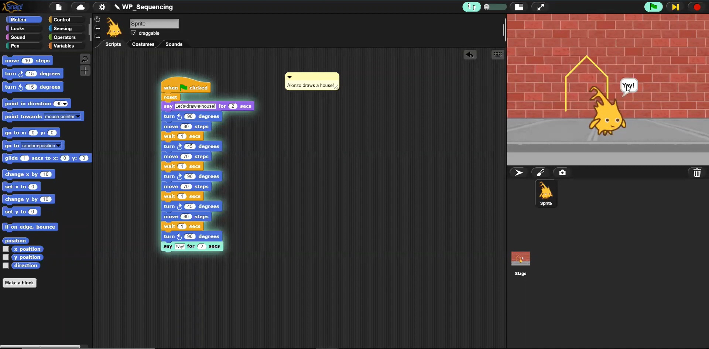
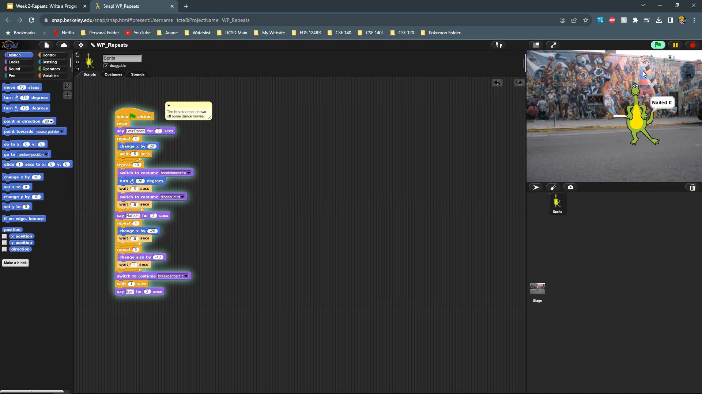
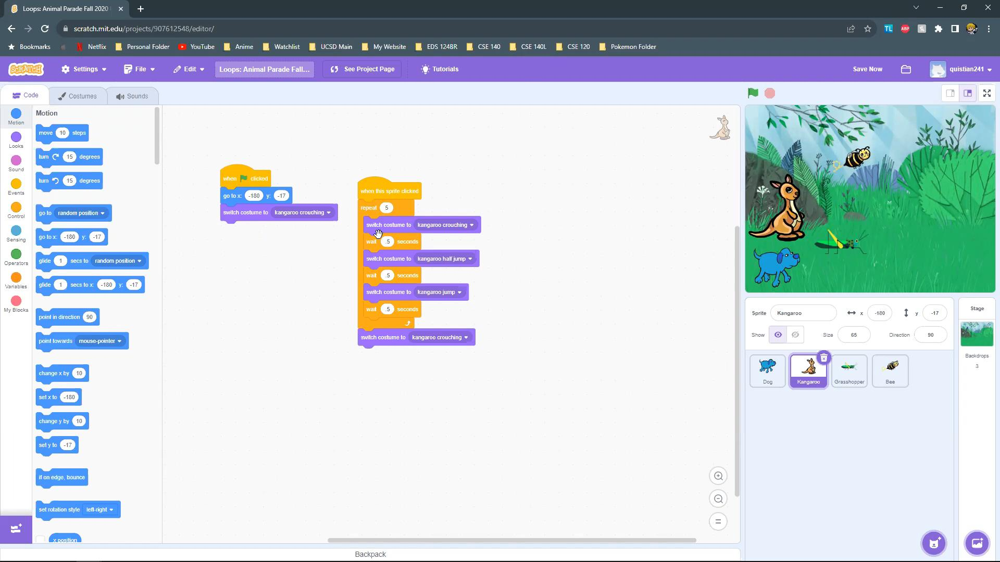
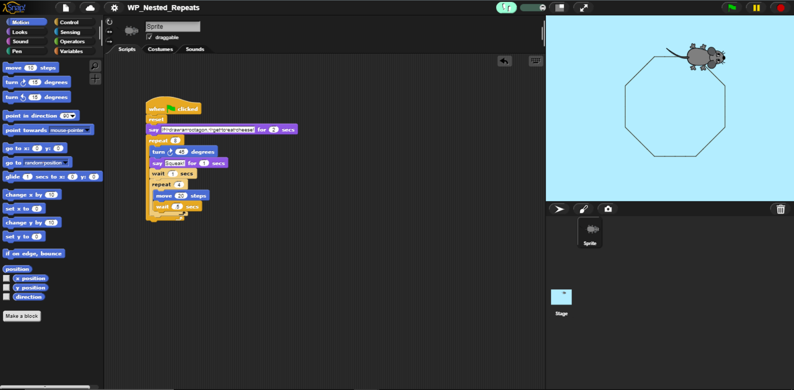

# **Teaching Programming Portfolio**
## By Cristian G.
_**Selected work from EDS 124BR Teaching Computational Thinking for Everyone**_
---
> 1. Explaing How Alonzo Draws a House
> [](https://youtu.be/tWW9FCE6wGY?si=NTRfDamZzI0V9IZH)
>
> 2. Using Repeats to Dance
> [](https://youtu.be/QRnxHfHTsy8?si=mAwSgeTzyF7fvRuJ)
>
> 3. Getting Animals to Move in Loops
> [](https://youtu.be/1g8zHfcfwtU)
> 4. Nested Loop Mouse
> [](https://youtu.be/Upe5gN-uqHs)
> 5. 
> - other facts...

```
# code block
```
