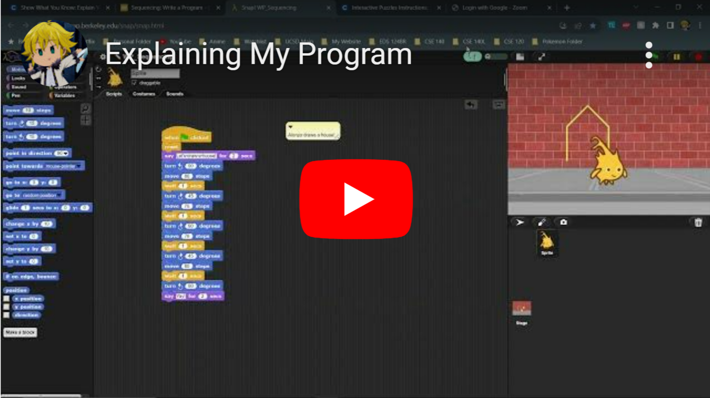

# **Teaching Programming Portfolio**
## By Cristian G.
_**Selected work from EDS 124BR Teaching Computational Thinking for Everyone**_
---
> 1. Explaing How Alonzo Draws a House
> [](https://youtu.be/tWW9FCE6wGY?si=NTRfDamZzI0V9IZH)
> 2. 
> 3. 
> 4. 
> 5. 

> - other facts...

```
# code block
```
